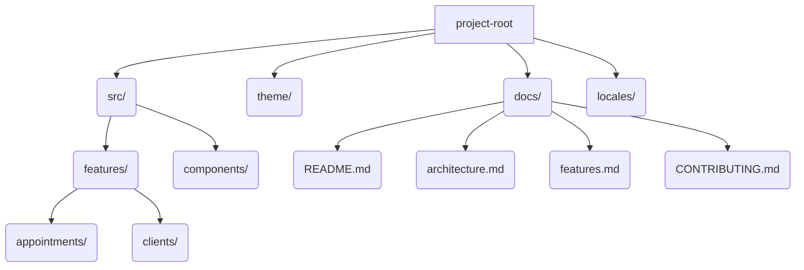

# Project Documentation

Welcome to the documentation for your React Native Appointment Booking App.

## Contents
- [Architecture Overview](architecture.md)
- [Features](features.md)
- [Contributing](CONTRIBUTING.md)

---

## Project Purpose
This app is a mobile-first appointment and recurring slot booking system for clinics, built with React Native. It supports therapist and room management, recurring bookings, and robust accessibility and testing practices.

## Quick Start
- See [CONTRIBUTING.md](CONTRIBUTING.md) for setup and contribution guidelines.
- See [features.md](features.md) for a breakdown of app features.
- See [architecture.md](architecture.md) for diagrams and technical structure.

---

## Directory Structure

---

## Key Technologies
- React Native (mobile-first, no web components)
- Redux (state management)
- Jest (testing)
- TypeScript

---

## Next Steps
- See [architecture.md](architecture.md) for component and data flow diagrams.
- See [features.md](features.md) for details on each feature and their APIs.
