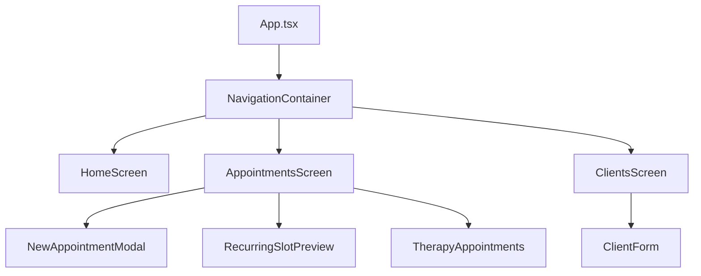
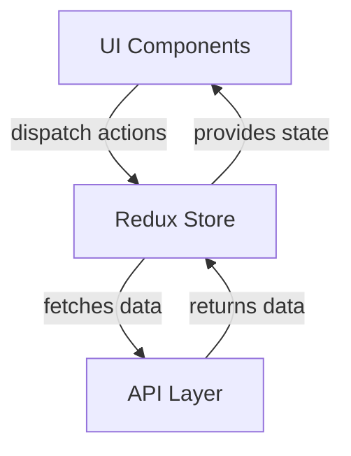

# Architecture Overview

This document provides a high-level overview of the application's architecture, including diagrams for component hierarchy, data flow, and directory structure.

---

## 1. Component Hierarchy

---

## 2. Data Flow (Redux & API)

---

## 3. Directory Structure
See main [README.md](README.md) for the Mermaid diagram.

---

## 4. Design Principles
- **Mobile-first:** All UI uses React Native primitives.
- **Separation of Concerns:** Features, theme, and localization are modularized.
- **Testability:** All logic is covered by Jest tests.
- **Accessibility:** Components use accessibility labels and testIDs.
