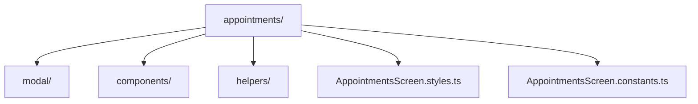

# Features Overview

This document summarizes the major features of the application and their responsibilities.

---

## Appointments
- Book single or recurring appointments.
- Handles therapist and room availability.
- Shows alternatives if preferred slot is unavailable.
- Supports accessibility and mobile-first design.

## Clients
- Add, edit, and search for clients.
- Uses prefix picker and patient search.

## Global
- Consistent theming and styling via `theme/`.
- Localization of all user-facing strings via `locales/`.
- Centralized error handling (planned).

---

## Example Feature Directory Structure

---

## Planned Features
- Global error boundary
- Improved SafeAreaView usage
- More robust localization
- Better documentation and onboarding
